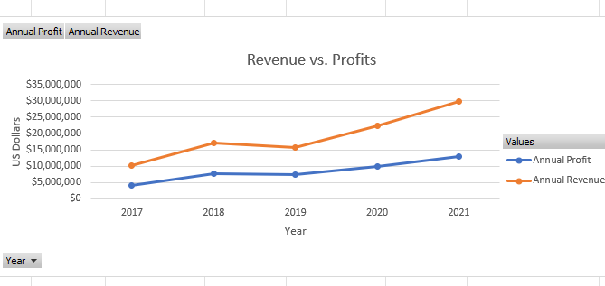

# Data-Analysing-Visualising-in-Excel

**Please download the dataset ‘Bike_Sales_Pivot_Lab.xlsx’ from [here.](https://justit831-my.sharepoint.com/:x:/g/personal/danpe_justit_co_uk/Eb73L6LixCJHtafDJ4AOh-ABR9CVF0n9sdEgB4foSh261g?e=jh493A)**

**The lab instructions can be found [here.](https://justit831-my.sharepoint.com/:b:/g/personal/danpe_justit_co_uk/EVySAtWQiEVDmrtCufrqTgwBuLVxX6mEKYqEAe0Mgl6b9Q?e=i05yOa)**

### Objectives

In this project, we will learn the basics of creating a pivot table in Microsoft Excel. Pivot tables provide a way to automatically summarise, analyse, explore, and present data. Charts add visualisations to the data in the pivot table that analyses trends and comparisons.  

### Creating an Excel Pivot Table

Pivot tables can reveal useful information in records or data that is not obvious at first sight by summarising and re-presenting the data so trends can be explored and reported. Pivot tables extract meaning from the data by grouping it in different ways, enabling useful conclusions to be made.

### Visualising Pivot Table Data

Presenting the pivot table as a graphical chart will highlight features of the data and assist in analysis and decision making. Line charts are commonly used to show trends over time or continuous data. They are great for visualizing changes, patterns, and fluctuations in data across a time period. Column charts are used to compare values across different categories. They can be used to display data that falls into discrete categories. Pie charts are effective for showing the proportions or percentages of a whole. Each "slice" of the pie represents a category's contribution to the total value. 

**Key Findings:**

Australia & United Kingdom has sales in all markets
Germany has bike sales only on Adult group.

Canada, Germany and United States there was no bike sales on Youth group.

Canada and France there was no bike sales on adult female group.

Most Profitable market by country- United States

Most Profitable market by age group – Adults (35-64)

Most Profitable market by gender - Female

**Data Source: Just IT, Google, ChatGPT**

**Full Project work book [here.](https://drive.google.com/file/d/1dRvYrJUP0yl3MCPxrpv98O1E8jtro_pq/view?usp=drive_link)**

**Click [here](https://github.com/Alamin-analyser/Python-GDP-Project) to see another Project.**
