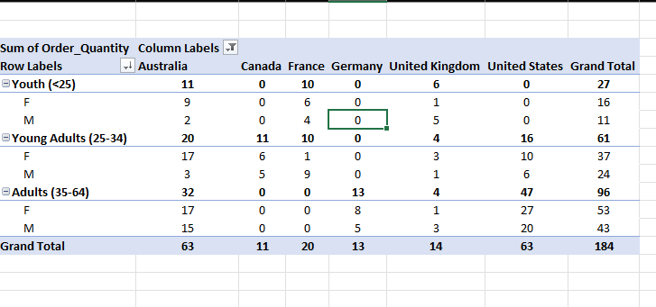
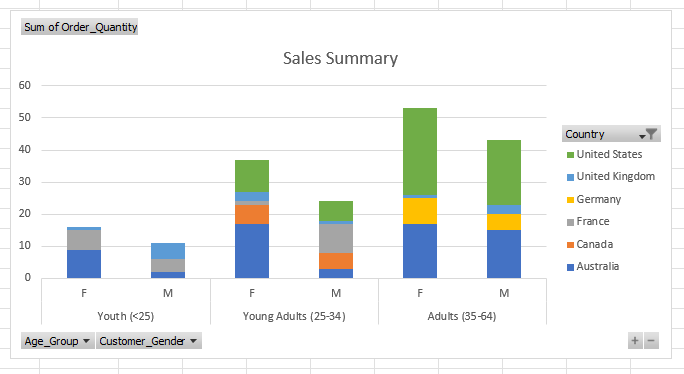
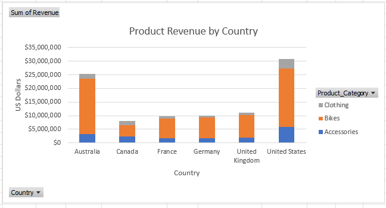
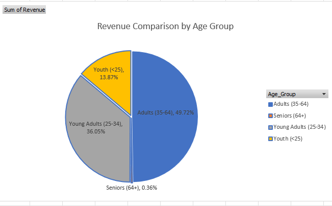

# Data-Analysing-Visualising-in-Excel

**Please download the dataset ‘Bike_Sales_Pivot_Lab.xlsx’ from [here.](https://justit831-my.sharepoint.com/:x:/g/personal/danpe_justit_co_uk/Eb73L6LixCJHtafDJ4AOh-ABR9CVF0n9sdEgB4foSh261g?e=jh493A)**

**The lab instructions can be found [here.](https://justit831-my.sharepoint.com/:b:/g/personal/danpe_justit_co_uk/EVySAtWQiEVDmrtCufrqTgwBuLVxX6mEKYqEAe0Mgl6b9Q?e=i05yOa)**

### Objectives

In this project, we will learn the basics of creating a pivot table in Microsoft Excel. Pivot tables provide a way to automatically summarise, analyse, explore, and present data. Charts add visualisations to the data in the pivot table that analyses trends and comparisons.  

### Creating an Excel Pivot Table

The pivot table created displays each country grouped under each age group, with the sum of the order quantity for each age group in total, and the total for each country under that age group.

### Visualising Pivot Table Data

Presenting the pivot table as a graphical chart will highlight features of the data and assist in analysis and decision making. 

**Full Project work book [here.](https://drive.google.com/file/d/1dRvYrJUP0yl3MCPxrpv98O1E8jtro_pq/view?usp=drive_link)**

**Click [here](https://github.com/Alamin-analyser/Python-GDP-Project) to see another Project.**
